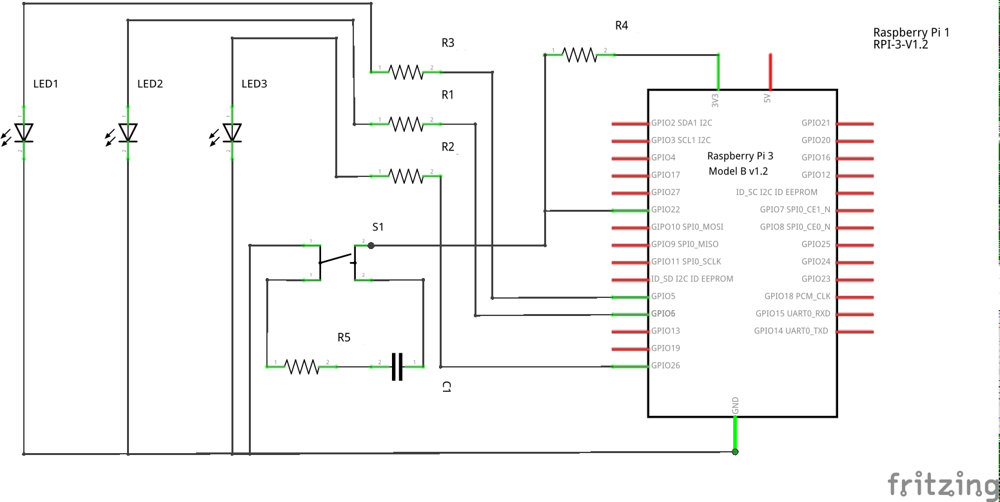

# ARM_lab

This repository contains assembly code and scripts used in the lab classes of the course "Architettura degli Elaboratori" of the Department of Computer Science of the University of Catania.

## Emulate Raspberry Pi OS on QEMU

In order to emulate Raspberry Pi OS on Ubuntu you need:

* qemu-system
* Latest qemu kernel
* Raspberry Pi OS image

### Download quemu-system using apt-get

```bash
sudo apt-get install qemu-system
```

### Get the latest qemu kernel

This [git repository](https://github.com/dhruvvyas90/qemu-rpi-kernel) contains the latest qemu-rpi kernel. I added a copy of the repository here in the folder ___qemu-rpi-kernel___

### Download Raspberry Pi OS image

You can find the image of the last Rspberry Pi OS in this [link](https://www.raspberrypi.org/software/operating-systems/). Follow the istructions and save the .img file in the main folder of this repository

## Run Raspberry Pi OS image on QEMU

First change the name of the image inside the start.sh script with the name of the image you downloaded (-hda argument):

```bash
#!/bin/bash

qemu-system-arm \
  -M versatilepb \
  -cpu arm1176 \
  -m 256 \
  -hda YOUR_IMAGE_NAME.img \
  -net nic -net user,hostfwd=tcp::5022-:22 \
  -dtb qemu-rpi-kernel/versatile-pb-buster.dtb \
  -kernel qemu-rpi-kernel/kernel-qemu-4.19.50-buster \
  -append 'root=/dev/sda2 panic=1' \
  -no-reboot 
```

Now you can simply run the script and qemu will start:

```bash
./start.sh
```

The default username and password for the Raspberry Pi OS are:
 
 * User: pi
 * Password: raspberry

### Connect via ssh to the Raspberry Pi OS

In order to connect via ssh to the Raspberry Pi OS running on qemu, open a terminal in Raspberry Pi OS and start the ssh service:

```bash
sudo service ssh start
```

You can now connect to the Raspberry Pi OS from your host system:

```bash
ssh pi@127.0.0.1 -p 5022 -X
```

And send file to the Raspberry Pi OS using scp:

```bash
scp -P 5022 -r PATH_OF_THE_FOLDER_IN_THE_HOST_SYSTEM pi@127.0.0.1:PATH_OF_THE_DESTINATION_FOLDER_IN_RASPBERRY_PI_OS
```

If SSH doesn’t start in your emulator at startup by default, you can change that inside your Pi terminal with:

```bash
sudo update-rc.d ssh enable
```

## Assembly code

Inside the ___assembly___ directory there are 2 programs written in assembly:

* prodottoMain.s: Simple program that calculates the product of 2 integers. The input numbers are read using the clib functions printf and scanf. The function that actually calculates the product is stored in a different source file (prodottoFunc.s)
* ledon.s: Simple program that uses some GPIO pins to control 3 leds pressing a button. This code will only run on a real raspberry hardware since the GPIO pins are not emulated in the kernel used here

### Assembling and running prodottoMain

In order to assemble prodottoMain in the raspberry Pi OS we can use gcc:

```bash
gcc -g -o prodotto prodottoFunc.s prodottoMain.s
```

After running gcc the executable is saved in the file prodotto. To run the program we can simply execute the following command:

```bash
./prodotto
```

If we want to run it in debug mode we can use gdb:

```bash
gdb ./prodotto
```

Please refer to this [tutorial](https://azeria-labs.com/debugging-with-gdb-introduction/) to learn how to use the basic function of gdb debugger

### Assembling and running ledon

In order to run this code you need a raspberry Pi 2/3 board. The program is expecting to have 3 leds connected to the pins GPIO 5, 6 and 26, and a button connected to the pin GPIO 22. The following schematic shows a possible way to connect the components to the board.



The led connected to GPIO26 will turn on everytime the button is pressed, the led on GPIO5 will switch its state whenever the button transits from not-pressed to pressed, and the led on GPIO6 will switch its state whenever the button transits from pressed to not-pressed.

In order to assemble ledon.s in the raspberry Pi OS use gcc:

```bash
gcc -g -o ledon ledon.s
```

To run the program execute the following command:

```bash
./ledon
```

If we want to run it in debug mode use this command:

```bash
gdb ./ledon
```

## Useful links

* [qemu kernels git repository](https://github.com/dhruvvyas90/qemu-rpi-kernel)
* [official download page for Raspberry Pi OS images](https://www.raspberrypi.org/software/operating-systems/)
* [gdb useful commands](https://azeria-labs.com/debugging-with-gdb-introduction/)
* [GNU ARM Assembler Quick Reference](https://www.ic.unicamp.br/~celio/mc404-2014/docs/gnu-arm-directives.pdf)
* [GPIO pins organization in the Raspberry Pi](https://www.raspberrypi.org/documentation/usage/gpio/)
* [BCM2837 ARM Peripherals Datasheet](https://cs140e.sergio.bz/docs/BCM2837-ARM-Peripherals.pdf)
* [Website with a VMware image of ubuntu with qemu alredy setted up](https://azeria-labs.com/arm-lab-vm/)

